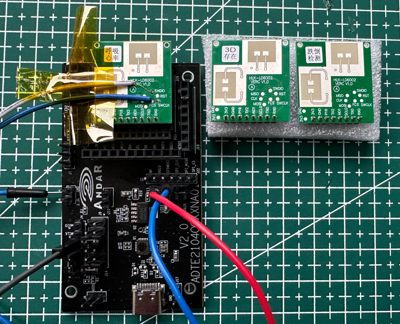

# HLK-LD6002-ADT6101P-internals
Internals &amp; reverse engineering of the HLK‑LD6002 radar (ADT6101P)

**Предупреждение:** я не являюсь сотрудником или партнером компаний HiLink и Andar. Вся информация в этом проекте не является официальной документацией.

HLK‑LD6002 - это радарный датчик от китайской компании [HiLink](https://www.hlktech.com/en/Goods-227.html), который работает в диапазоне 60 Ghz. 
Его заявленные возможности:
1. Измерение сердцебиения и дыхания на расстоянии. Расстояние он также сообщает. HLK-6002
2. Определяет факт падения человека. HLK-6002C
3. Определяет до 4 объектов перед ним и указывает их координаты. HLK-6002B
4. Измеряет сердцебиение и дыхание младенцев на расстоянии. HLK-6002H

Все это на расстоянии до 1.5-3 метров до человека.

Мне очень понравилась идея недорогого датчика с такими широкими возможностями. Также мне бы хотелось познакомиться 
поближе с технологией работы радаров на такой высокой частоте.

## Определимся с терминами
- HLK-LD6002 - это готовый продукт - датчик, который выпускает компания HiLink, на основе чипа ADT6101P.
- ADT6101P - это чип от компании [Andar](http://www.andartechs.com/bk_24853220.html###), который предназначен для разработки радаров 60 Ghz  

Процесс исследования заключается в определении внутреннего устройства ADT6101P и как именно он интегрирован в устройство HLK-6002.

## Задачи проекта
- [x] [Чтение прошивки из Flash микросхемы датчика HLK-LD6002](docs/how-to-read-flash-hlk-ld6002.ru.md).
- [x] Подключение JTAG адаптера для отладки. 
- [x] Чтение bootloader из ADT6101P, чтобы понять, как происходит загрузка прошивки.
- [ ] Обновление прошивки простым способом, без использования программы под Windows.
- [ ] Получение "сырых" радиоданных из чипа на host computer.
- [ ] Возможность переключать разные прошивки в датчике, чтобы менять его функциональность на лету.
- [ ] Разработка собственных прошивок для расширения возможностей датчика.

## Откуда я черпал вдохновение для проекта
1. [Seeed Studio](https://wiki.seeedstudio.com/) и их датчик [MR60BHA2](https://wiki.seeedstudio.com/getting_started_with_mr60bha2_mmwave_kit/), который легко подключается к Home Assistant. С покупки их датчика и началось мое знакомство с HLK-6002. На сайте есть много информации об этом датчике и это хорошее место для начала исследований.
2. Проект [RTL-SDR](https://www.rtl-sdr.com/). Из недорогого TV тюнера исследователи сделали универсальный SDR приемник!
2. nRF24L01 - обычный недорого чип для беспроводной связи стал стандартом дефакто для исследования диапазона 2.4 Ghz.
