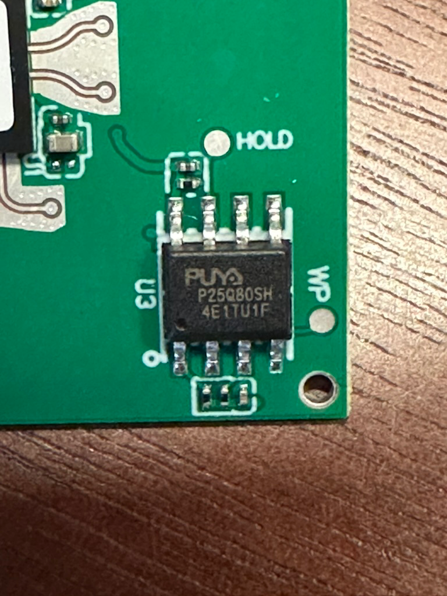
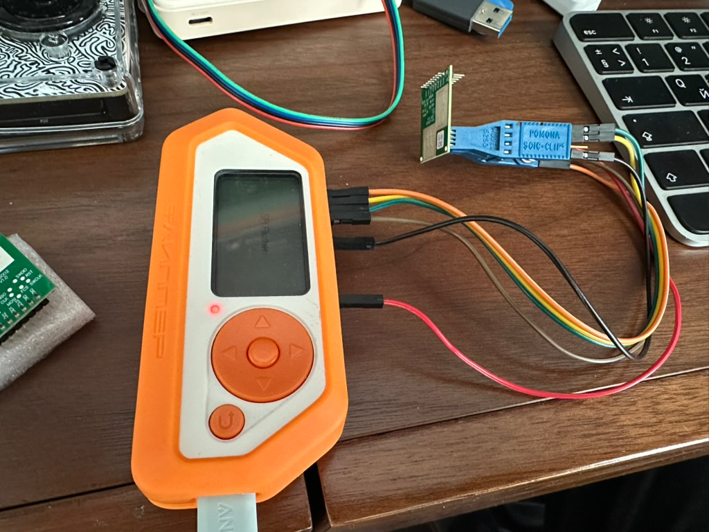

# How to read a flash from HLK-LD6002
[](how-to-read-flash-hlk-ld6002.md)
[](how-to-read-flash-hlk-ld6002.ru.md)

To read (or write) data from the HLK-LD6002 sensor’s flash, you will need a Flipper Zero, a Pomona SOIC-Clip, a set of wires, and the Flipper Zero app — [Serprog SPI Flasher](https://github.com/Psychotropos/flipper_serprog).

**Warning:** do not power the HLK-LD6002!

1. Connect the clip and the Flipper with wires according to this scheme:
```
| Name |  Flipper  | Flash IC |
+------+-------+---+----------+
| PA7  | MOSI  | 2 |     5    |
| PA6  | MISO  | 3 |     2    |
| PA4  | CS    | 4 |     1    |
| PB3  | SCK   | 5 |     6    |
| GND  | GND   | 8 |     4    |
| 3.3  | VCC   | 9 |     8    |
+------+-------+---+----------+
```

2. Attach the clip to the flash IC, paying attention to the orientation. The flash IC is shown in the picture below.

  
[P25Q80SH Flash Memory Datasheet](https://www.puyasemi.com/download_path/%E6%95%B0%E6%8D%AE%E6%89%8B%E5%86%8C/Flash/P25Q80SH_Datasheet_V1.4.pdf)

It should look roughly like this:


3. Launch the **Serial Flash Programmer** app on the Flipper Zero and connect the Flipper to your computer.

4. Use the `flashrom` utility to read data from the flash:  
   `flashrom -p serprog:dev=/dev/cu.usbmodemflip_Yc4d03 -VV -r hlk-ld6002-heard-rate.bin`

The result is a file of 1 MB.
