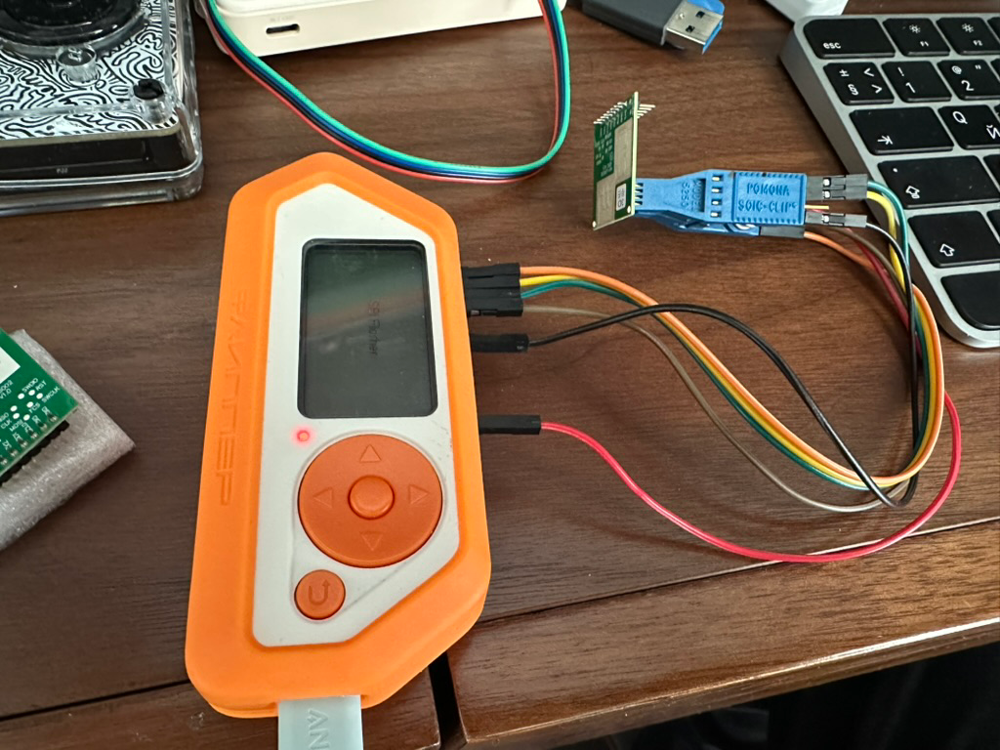

# How to read a flash from HLK-LD6002
[](how-to-read-flash-hlk-ld6002.md)
[](how-to-read-flash-hlk-ld6002.ru.md)

Чтобы прочитать (или записать) данные из flash датчика HLK-LD6002 понадобится Flipper Zero, прищепка Pomona SOIC-Clip, 
набор проводов и приложение для Flipper Zero - [Serprog SPI Flasher](https://github.com/Psychotropos/flipper_serprog).

**Внимание:** подключать питание на HLK-LD6002 не нужно!

1. Нужно соединить клипсу и Flipper проводами по такой схеме:
```
| Name |  Flipper  | Flash IC |
+------+-------+---+----------+
| PA7  | MOSI  | 2 |     5    |
| PA6  | MISO  | 3 |     2    |
| PA4  | CS    | 4 |     1    |
| PB3  | SCK   | 5 |     6    |
| GND  | GND   | 8 |     4    |
| 3.3  | VCC   | 9 |     8    |
+------+-------+---+----------+
```

2. Прицепляем клипсу к микросхеме Flash, обращая внимание на полярность. Микросхема flash на картинке ниже.


[P25Q80SH Flash Memory Datasheet](https://www.puyasemi.com/download_path/%E6%95%B0%E6%8D%AE%E6%89%8B%E5%86%8C/Flash/P25Q80SH_Datasheet_V1.4.pdf)

Должно получиться примерно так:



3. Запускаем на Flipper Zero приложение "Serial Flash Programmer" и подключаем Flipper к компу.
4. С помощью утилиты flashrom читаем данные из flash:
`flashrom -p serprog:dev=/dev/cu.usbmodemflip_Yc4d03 -VV -r hlk-ld6002-heard-rate.bin`

Получается файл размером в 1Мб.
